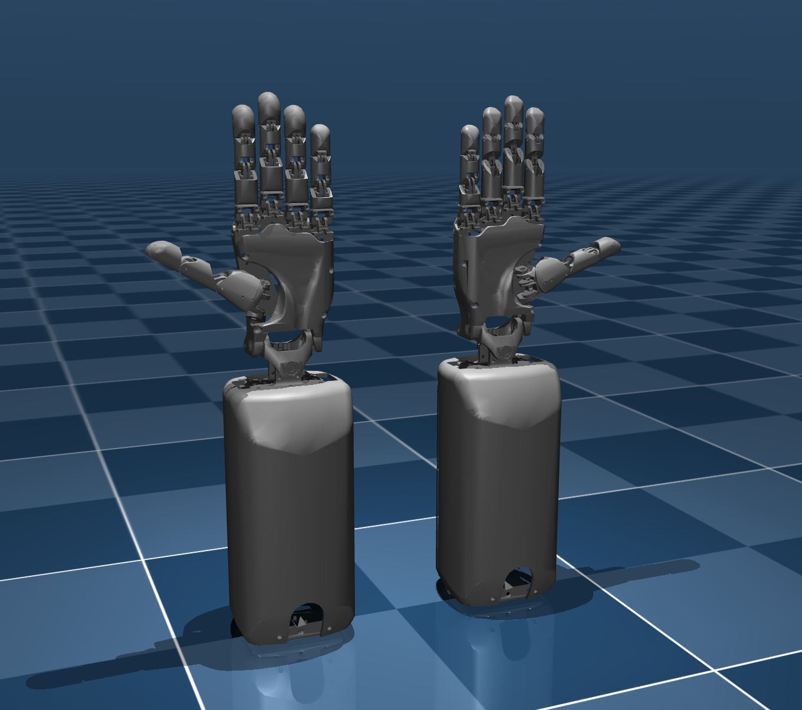

# Table of Contents

<toc>

[*Last generated: Thu Jul 31 16:26:17 PDT 2025*]
- [Table of Contents](#table-of-contents)
- [Pro-Models: Professional Hand Simulation Models](#pro-models-professional-hand-simulation-models)
  - [Overview](#overview)
  - [Model Structure](#model-structure)
  - [Collision Representations](#collision-representations)
    - [Convex Hull Representation](#convex-hull-representation)
    - [Capsule Hybrid Representation](#capsule-hybrid-representation)
  - [Quick Start](#quick-start)
    - [Installation](#installation)
    - [Running the Example Viewer](#running-the-example-viewer)
  - [Joint Configuration](#joint-configuration)
  - [Performance Considerations](#performance-considerations)
    - [Mesh Selection](#mesh-selection)
    - [Collision Detection](#collision-detection)
  - [Contributing](#contributing)
  - [License](#license)
    - [✅ Permitted Use:](#-permitted-use)
    - [❌ Prohibited Use:](#-prohibited-use)
    - [🤝 Commercial Collaborations](#-commercial-collaborations)
  - [Citation](#citation)
  - [Support](#support)
  - [Related Projects](#related-projects)

</toc>


# Pro-Models: Professional Hand Simulation Models

A comprehensive collection of high-fidelity robotic hand simulation models for MuJoCo, featuring ProHand V17 (left) and ProHand V18R (right) with multiple collision representations and optimized meshes.

| Both Hand Example Demo                            |
|:-------------------------------------------------:|
|  | 

## Overview

This repository contains professional-grade robotic hand models designed for simulation and research applications:

- **ProHand V17 (Left Hand)**: 5-finger anthropomorphic hand with 20+ degrees of freedom
- **ProHand V18R (Right Hand)**: minor improvements
- (more versions rolling=out ...)

Both models feature:
- **Finger Configuration**: 5 fingers (thumb, index, middle, ring, pinky)
- **Joint Structure**: 20+ degrees of freedom per hand (including 2 DOF wrist)
- **Collision Models**: Convex hull and capsule hybrid representations
- **Mesh Quality**: Both convex and optimized mesh variants
- **Applications**: Research, development, and simulation

## Model Structure

```
assets/
├── meshes/
│   ├── gen_1_7_L_description/     # ProHand V17 (Left)
│   └── gen_1_8_R_description/     # ProHand V18R (Right)
│       ├── convex/                # Convex hull meshes
│       └── optimized/             # Optimized detailed meshes
└── mjcf/
    ├── gen_1_7_L_description/     # MJCF configuration files
    └── gen_1_8_R_description/     # MJCF configuration files
        ├── include_ProHand_V17_convex_chain.xml
        ├── include_ProHand_V17_convex_config.xml
        ├── include_ProHand_V17_capsule_hybrid_chain.xml
        ├── include_ProHand_V17_capsule_hybrid_config.xml
        ├── include_ProHand_V18R_convex_chain.xml
        ├── include_ProHand_V18R_convex_config.xml
        ├── include_ProHand_V18R_capsule_hybrid_chain.xml
        └── include_ProHand_V18R_capsule_hybrid_config.xml
```

## Collision Representations

Each hand model provides two collision representation options:

### Convex Hull Representation
- **File Pattern**: `*_convex_*.xml`
- **Advantages**: Fast collision detection, suitable for real-time simulation
- **Use Cases**: Control development, real-time applications

### Capsule Hybrid Representation
- **File Pattern**: `*_capsule_hybrid_*.xml`
- **Advantages**: Faster and simpler collision detection, for contact-rich simulation
- **Use Cases**: Research, fast simulation, contact analysis

## Quick Start

### Installation
```bash
# Clone the repository
git clone <repository-url>
cd pro-models

# Install dependencies
pip install -r example/requirements.txt
```

### Running the Example Viewer
```bash
# View left hand only
python example/hand_viewer.py left

# View right hand only  
python example/hand_viewer.py right

# View both hands
python example/hand_viewer.py both
```

## Joint Configuration

Both hands feature similar joint structures:
- **Wrist**: 2 DOF (yaw, pitch)
- **Thumb**: 4 DOF (metacarpal, proximal, distal, trapezium)
- **Fingers**: 4 DOF each (metacarpal, proximal, middle, distal)

**ProHand V18R** includes enhanced thumb kinematics and improved joint limits.

## Performance Considerations

### Mesh Selection
- **Convex Meshes**: ~50% faster simulation, suitable for real-time applications
- **Optimized Meshes**: Better visual quality, recommended for research and analysis

### Collision Detection
- **Convex Hull**: Fastest collision detection, good for control development
- **Capsule Hybrid**: More accurate contact modeling, better for research

## Contributing

We welcome contributions to improve the models, add new features, or enhance documentation. Please:

1. Fork the repository
2. Create a feature branch
3. Make your changes
4. Submit a pull request

## License

These models are made available under a **custom non-commercial academic license**.  
Please read the full [LICENSE.txt](./LICENSE.txt) for legal terms.

### ✅ Permitted Use:
- Academic and non-commercial research
- Internal evaluation and benchmarking
- Simulation, visualization, and experimentation within a lab or educational context

### ❌ Prohibited Use:
- Any **commercial application**, including but not limited to:
  - Proprietary software or SDKs
  - Paid services or consulting
  - Commercial product development
- **Redistribution**, uploading to other repositories, or public forks without prior permission

### 🤝 Commercial Collaborations

We welcome research partnerships and commercial collaborations.  
Please contact us to discuss licensing:

📧 **[contact@proception.ai]**

## Citation

If you use these models in your research, please cite:

```bibtex
@misc{pro_models_2024,
  title={Pro-Models: Proception Inc. Simulation Models for MuJoCo},
  author={Proception Inc., Jianxiang Xu, etc.},
  year={2025},
  url={https://github.com/Proception-AI/pro-models}
}
```

## Support

For questions, issues, or feature requests, please:
- Open an issue on GitHub
- Check the example code in the `example/` directory
- Review the model specifications in the `assets/` directory

## Related Projects

- [MuJoCo](http://www.mujoco.org/) - Physics engine
- [ProHand Documentation](link-to-prohand-docs) - Original hand specifications
- [Example Viewer](./example/) - Interactive model viewer 

<eof>

---
[*> Back To Top <*](#Table-of-Contents) | Rights Reserved @ Proception AI, Inc. 2024-2025
</eof>
